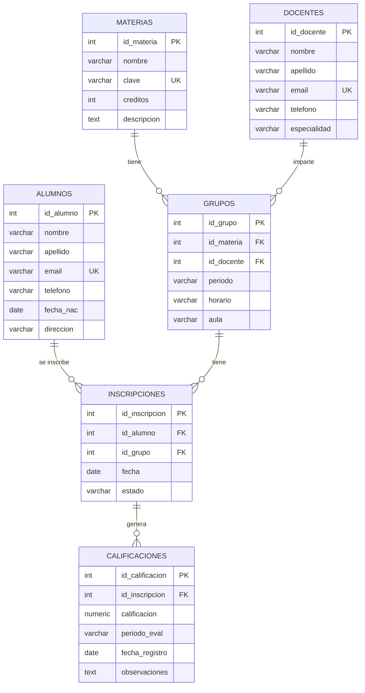

# Modelo Entidad-Relación y Modelo Relacional

## Modelo Entidad-Relación (MER)



## Modelo Relacional

```
ALUMNOS (id_alumno PK, nombre, apellido, email UNIQUE, telefono, fecha_nac, direccion, created_at)

DOCENTES (id_docente PK, nombre, apellido, email UNIQUE, telefono, especialidad, created_at)

MATERIAS (id_materia PK, nombre NOT NULL, clave UNIQUE, creditos CHECK(>0), descripcion, created_at)

GRUPOS (id_grupo PK, id_materia FK→MATERIAS, id_docente FK→DOCENTES, periodo, horario, aula, created_at)

INSCRIPCIONES (id_inscripcion PK, id_alumno FK→ALUMNOS, id_grupo FK→GRUPOS, fecha DEFAULT CURRENT_DATE, estado, created_at)
  UNIQUE(id_alumno, id_grupo)

CALIFICACIONES (id_calificacion PK, id_inscripcion FK→INSCRIPCIONES, calificacion CHECK(0-100), periodo_eval, fecha_registro, observaciones, created_at)
```

## Normalización hasta 3FN

### Primera Forma Normal (1FN)
✅ Todas las tablas cumplen 1FN:
- Cada celda contiene un valor atómico (no hay listas ni conjuntos)
- Cada tabla tiene una clave primaria definida (SERIAL)
- No hay grupos repetitivos

### Segunda Forma Normal (2FN)
✅ Todas las tablas cumplen 2FN:
- Están en 1FN
- Todos los atributos no clave dependen completamente de la clave primaria
- No hay dependencias parciales (todas las PK son simples/SERIAL)
- La restricción UNIQUE(id_alumno, id_grupo) en `inscripciones` no es PK, por lo que no genera dependencias parciales

### Tercera Forma Normal (3FN)
✅ Todas las tablas cumplen 3FN:
- Están en 2FN
- No hay dependencias transitivas entre atributos no clave
- Ejemplos:
  - En `grupos`, `id_materia` y `id_docente` son FKs, no dependen entre sí
  - En `calificaciones`, todos los atributos dependen de `id_calificacion`
  - La información del alumno está en `alumnos`, no duplicada en `inscripciones`
  - La información de la materia está en `materias`, no duplicada en `grupos`

### Justificación del Diseño
| Relación | Tipo | Justificación |
|---|---|---|
| Alumno → Inscripción | 1:N | Un alumno puede tener múltiples inscripciones |
| Grupo → Inscripción | 1:N | Un grupo tiene múltiples alumnos inscritos |
| Inscripción → Calificación | 1:N | Una inscripción puede tener múltiples calificaciones (parciales) |
| Materia → Grupo | 1:N | Una materia puede tener múltiples grupos |
| Docente → Grupo | 1:N | Un docente puede impartir múltiples grupos |
